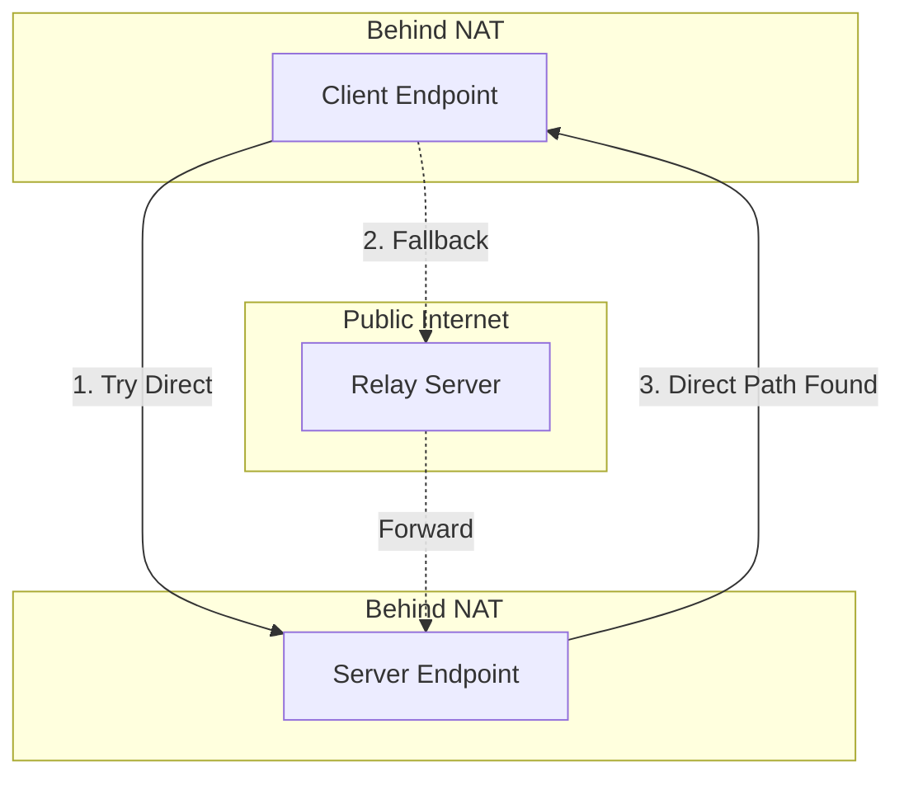

# Part 01: Your First Iroh Connection

You're going to build a working peer-to-peer application before understanding half of what you're doing. This is intentional. We'll work backwards from something that works, then understand why it works.

## What You're Building

An echo server. Not particularly exciting, but it's the "hello world" of networking. One endpoint sends a message, another echoes it back. Except instead of going through a central server like your typical client-server application, these two endpoints will find each other across the internet, punch through NAT, and establish a direct encrypted connection. If that fails, they'll route through a relay server.

Think of it like two phones trying to call each other directly without a phone company in the middle. When that doesn't work, they'll use a relay (which is sort of like a phone company, but can't listen to your conversation).

## The Iroh Model vs Python's Socket Model

In Python, you'd typically do this:

```python
# Server
import socket

server = socket.socket()
server.bind(('0.0.0.0', 8080))
server.listen()
conn, addr = server.accept()
data = conn.recv(1024)
conn.send(data)
```

This requires:
- The client knows the server's IP address
- The server has a public IP or port forwarding configured
- No encryption (unless you add TLS yourself)
- Single connection model (unless you thread it)

Iroh flips this model. Both peers are equal. Either can initiate. Neither needs a public IP. Encryption is built in. You identify peers by public key, not IP address. The "address" is a suggestion, not a requirement.

## Setting Up Your Project

```bash
cargo new --bin iroh_echo
cd iroh_echo
cargo add iroh tokio n0_error
```

Three dependencies:
- `iroh`: The star of the show
- `tokio`: Async runtime (we'll get to why later)
- `n0_error`: Error handling that's actually usable

## The Code

Create `src/main.rs`:

```rust
use iroh::{
    Endpoint, EndpointAddr,
    endpoint::Connection,
    protocol::{AcceptError, ProtocolHandler, Router},
};
use n0_error::{Result, StdResultExt};

const ALPN: &[u8] = b"echo/0";

#[tokio::main]
async fn main() -> Result<()> {
    let router = start_server().await?;
    router.endpoint().online().await;

    let server_addr = router.endpoint().addr();
    run_client(server_addr).await?;

    router.shutdown().await.anyerr()?;
    Ok(())
}

async fn start_server() -> Result<Router> {
    let endpoint = Endpoint::bind().await?;
    let router = Router::builder(endpoint).accept(ALPN, Echo).spawn();
    Ok(router)
}

async fn run_client(addr: EndpointAddr) -> Result<()> {
    let endpoint = Endpoint::bind().await?;
    let conn = endpoint.connect(addr, ALPN).await?;

    let (mut send, mut recv) = conn.open_bi().await.anyerr()?;

    send.write_all(b"Hello, iroh!").await.anyerr()?;
    send.finish().anyerr()?;

    let response = recv.read_to_end(1000).await.anyerr()?;
    println!("Got: {}", String::from_utf8_lossy(&response));

    conn.close(0u32.into(), b"bye");
    endpoint.close().await;

    Ok(())
}

#[derive(Debug, Clone)]
struct Echo;

impl ProtocolHandler for Echo {
    async fn accept(&self, connection: Connection) -> Result<(), AcceptError> {
        let (mut send, mut recv) = connection.accept_bi().await?;
        tokio::io::copy(&mut recv, &mut send).await?;
        send.finish()?;
        connection.closed().await;
        Ok(())
    }
}
```

Run it:

```bash
cargo run
```

You should see `Got: Hello, iroh!`. Congratulations, you just established a peer-to-peer QUIC connection.

## What Just Happened

Let's work backwards.

### The Echo Handler

```rust
struct Echo;

impl ProtocolHandler for Echo {
    async fn accept(&self, connection: Connection) -> Result<(), AcceptError> {
        let (mut send, mut recv) = connection.accept_bi().await?;
        tokio::io::copy(&mut recv, &mut send).await?;
        send.finish()?;
        connection.closed().await;
        Ok(())
    }
}
```

This is your protocol. When someone connects with the `echo/0` ALPN (we'll get to that), this code runs. It accepts a bidirectional stream, copies everything from receive to send (echoing it), then waits for the connection to close.

In Python terms, this is like:

```python
def handle_connection(conn):
    data = conn.recv(1024)
    conn.send(data)
    conn.close()
```

Except it's async, handles backpressure, doesn't have arbitrary buffer limits, and runs in its own task automatically.

### The ALPN

```rust
const ALPN: &[u8] = b"echo/0";
```

Application-Layer Protocol Negotiation. Both sides must agree on this bytestring or the connection fails. Think of it as a version string for your protocol. HTTP/3 uses `h3`. You're using `echo/0`.

Why? Because you might run multiple protocols over the same endpoint. Maybe `echo/0` for testing and `filetransfer/1` for real work. The ALPN routes the connection to the right handler.

### The Server

```rust
async fn start_server() -> Result<Router> {
    let endpoint = Endpoint::bind().await?;
    let router = Router::builder(endpoint).accept(ALPN, Echo).spawn();
    Ok(router)
}
```

`Endpoint::bind()` creates your local endpoint. It:
- Generates a public/private keypair (your identity)
- Binds to a UDP port (QUIC runs over UDP)
- Connects to a relay server (for NAT traversal)
- Starts the magic that makes P2P work

The `Router` maps ALPNs to handlers. When a connection comes in with `echo/0`, it routes to your `Echo` handler.

### The Client

```rust
async fn run_client(addr: EndpointAddr) -> Result<()> {
    let endpoint = Endpoint::bind().await?;
    let conn = endpoint.connect(addr, ALPN).await?;

    let (mut send, mut recv) = conn.open_bi().await.anyerr()?;

    send.write_all(b"Hello, iroh!").await.anyerr()?;
    send.finish().anyerr()?;

    let response = recv.read_to_end(1000).await.anyerr()?;
    // ...
}
```

The client creates its own endpoint (yes, both sides have endpoints), connects to the server's address, opens a bidirectional stream, sends data, and reads the echo.

`send.finish()` is like closing the write half of a socket. It says "I'm done sending, but I still want to receive."

### The Address

```rust
let server_addr = router.endpoint().addr();
```

This `EndpointAddr` contains:
- The server's public key (its identity)
- Relay URL (how to reach it via relay)
- Direct addresses (IP:port pairs, if reachable)

In Python, you'd just pass `('localhost', 8080)`. Here, you pass an address that can work across the internet, behind NATs, with encrypted identity verification built in.

## What You're Not Seeing

A lot is happening behind the scenes:

1. **NAT traversal**: Both endpoints are trying to establish a direct connection using STUN/ICE techniques
2. **Relay fallback**: If direct connection fails, traffic routes through a relay server
3. **Encryption**: TLS 1.3, using the endpoint's keypair
4. **Connection migration**: If your network changes, the connection can migrate to new addresses
5. **Congestion control**: QUIC's built-in CC, better than TCP

You didn't configure any of this. It just works. This is iroh's entire point.

## The Async Elephant

Everything is `async fn` and `await`. If you're coming from Python's `asyncio`, this is similar but with compile-time guarantees. If you're new to async:

Async functions don't run immediately. They return a `Future` that must be `.await`ed. The `#[tokio::main]` macro sets up the runtime that executes these futures.

```rust
async fn foo() -> u32 {
    42
}

// This doesn't run foo!
let future = foo();

// This runs foo and gets the result
let result = future.await;
```

Why async? Because networking is all about waiting. Waiting for data, waiting for connections, waiting for the other side to respond. Async lets you wait efficiently, handling thousands of connections in one thread.

Python equivalent:

```python
async def foo():
    return 42

# Doesn't run
coro = foo()

# Runs
result = await coro
```

Rust's version is zero-cost (no boxing), statically checked (no "forgot to await" bugs at runtime), and compiles to efficient state machines.

## Exercise: Make It Real

Right now, the server and client run in the same process. That's cheating. Make them separate programs.

**Hints**:
- Split into `server.rs` and `client.rs`
- Server should print its `EndpointId` and `EndpointAddr`
- Client should take these as command-line arguments
- You'll need to serialize the address (it has a `to_string()` method)
- Test across two machines if you can, or at least two terminal windows

**Python comparison**: This is like running your socket server in one terminal and client in another. Except now they can be on different networks, behind NATs, and they'll still connect.

## What You Learned

- Iroh uses public keys as identities, not IP addresses
- Both peers are equal (no strict client/server)
- ALPN routes connections to protocol handlers
- QUIC gives you multiple streams over one connection
- Async is unavoidable in networking, embrace it
- A lot of complexity (NAT, encryption, relay) is handled automatically

Next up: we'll actually understand Rust by reading iroh's source code. You've written Rust; now we'll learn what it means.

## Architecture Overview



The connection establishment tries direct first, falls back to relay, then migrates to direct if possible. You don't control this. Iroh does.
