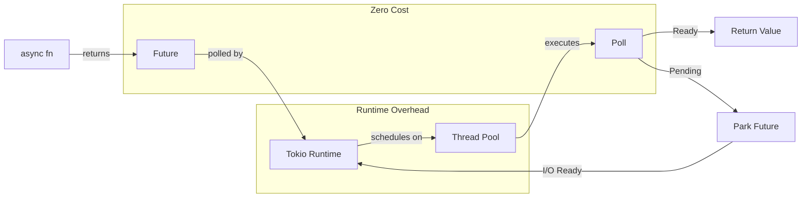

# Part 03: Async Rust and QUIC Streams

Everything in iroh is async. Every connection, every stream, every I/O operation. If you try to do blocking I/O in an iroh application, you'll find yourself fighting the runtime. Let's understand why async exists, how it works, and how QUIC's stream model makes it even better.

## The Problem With Blocking I/O

Traditional Python socket code looks like this:

```python
import socket

sock = socket.socket()
sock.connect(('example.com', 80))
sock.send(b'GET / HTTP/1.0\r\n\r\n')
data = sock.recv(4096)  # Blocks until data arrives
print(data)
```

That `recv` call blocks the entire thread. If you want to handle 10,000 concurrent connections, you need 10,000 threads. Each thread needs a stack (maybe 2MB). That's 20GB of memory just for stacks, plus the overhead of context switching between threads.

The traditional solution: non-blocking I/O with event loops (select/poll/epoll). Python's `asyncio`:

```python
async def fetch(url):
    reader, writer = await asyncio.open_connection('example.com', 80)
    writer.write(b'GET / HTTP/1.0\r\n\r\n')
    data = await reader.read(4096)
    return data
```

The `await` doesn't block the thread. It yields control back to the event loop, which can do other work. One thread can handle thousands of concurrent connections.

Rust's async is the same idea, but with compile-time guarantees and zero-cost abstractions.

## Futures: The Core Abstraction

An `async fn` doesn't execute immediately. It returns a `Future`:

```rust
async fn fetch_data() -> Vec<u8> {
    // This doesn't run yet
    let stream = endpoint.connect(addr, ALPN).await?;
    // Neither does this
    stream.read_to_end(1000).await?
}

fn main() {
    let future = fetch_data();  // Nothing happened yet
    // To actually run it:
    tokio::runtime::Runtime::new()?.block_on(future);
}
```

A `Future` is a state machine. Each `.await` point becomes a state transition. The compiler transforms your async function into something like:

```rust
enum FetchDataFuture {
    Start,
    Connecting { future: ConnectFuture },
    Reading { stream: RecvStream, buffer: Vec<u8> },
    Done(Vec<u8>),
}

impl Future for FetchDataFuture {
    type Output = Vec<u8>;

    fn poll(self: Pin<&mut Self>, cx: &mut Context) -> Poll<Vec<u8>> {
        match self {
            Start => {
                // Initiate connection
                // Transition to Connecting state
            }
            Connecting { future } => {
                // Poll the connect future
                // If ready, transition to Reading
                // If pending, return Pending
            }
            Reading { stream, buffer } => {
                // Poll the read operation
                // If ready, transition to Done
                // If pending, return Pending
            }
            Done(data) => Poll::Ready(data),
        }
    }
}
```

This is a simplification, but the idea holds: async functions compile to efficient state machines with zero allocation for the future itself.

Python's `async/await` is similar conceptually, but the implementation is different. Python uses generator-based coroutines (pre-3.5) or native coroutines (post-3.5), which involve more runtime overhead.

## Tokio: The Runtime

Rust's async is "zero-cost" because it's just a state machine. But something has to drive those state machines forward. That's the runtime. Iroh uses tokio.

```rust
#[tokio::main]
async fn main() -> Result<()> {
    // Your async code here
}
```

This macro expands to:

```rust
fn main() -> Result<()> {
    tokio::runtime::Runtime::new()?
        .block_on(async {
            // Your async code here
        })
}
```

Tokio creates a thread pool (by default, one thread per CPU core), an event loop per thread, and a work-stealing scheduler. When a future is `.await`ed and returns `Poll::Pending`, tokio parks it. When the underlying I/O is ready, tokio wakes the future and polls it again.

You can spawn tasks (like goroutines or green threads):

```rust
tokio::spawn(async {
    // Runs concurrently with the rest of your code
    handle_connection(conn).await;
});
```

Python comparison with `asyncio`:

```python
async def main():
    # Your async code here

if __name__ == "__main__":
    asyncio.run(main())
```

Similar concept. Tokio is more complex because it handles true multi-threading (no GIL), work stealing, and more sophisticated I/O primitives.

## QUIC Streams: Better Than TCP

TCP gives you one reliable, ordered byte stream per connection. To multiplex multiple logical streams, you need application-level framing (like HTTP/2).

QUIC gives you multiple streams per connection, natively:

```rust
let conn = endpoint.connect(addr, ALPN).await?;

// Open multiple streams concurrently
let stream1 = conn.open_bi().await?;
let stream2 = conn.open_bi().await?;
let stream3 = conn.open_uni().await?;
```

Each stream is independent. If one stream stalls due to packet loss, the others continue. This solves TCP's head-of-line blocking problem.

### Bidirectional Streams

```rust
let (mut send, mut recv) = conn.open_bi().await?;

send.write_all(b"request").await?;
send.finish()?;  // Half-close: done sending, but still receiving

let response = recv.read_to_end(1024).await?;
```

Both sides can send and receive. The stream remains open until both sides have finished sending and received all data.

Python comparison (awkward because Python's asyncio doesn't have native QUIC support):

```python
# With TCP, you'd need application-level framing
writer.write(b"request")
await writer.drain()
response = await reader.read(1024)
```

But this is over a single TCP stream. To get multiple concurrent requests, you need HTTP/2-style multiplexing, which is complex and still suffers from head-of-line blocking at the TCP level.

### Unidirectional Streams

```rust
let mut send = conn.open_uni().await?;
send.write_all(b"notification").await?;
send.finish()?;
```

Only the opener can send. The receiver can only read. Useful for push notifications, logging, telemetry.

### Stream Priorities

QUIC streams can have priorities (though iroh doesn't expose this yet in the high-level API). Higher-priority streams get bandwidth first. This is built into the protocol, unlike TCP where all data is equal.

## Reading and Writing Streams

Iroh's streams implement tokio's `AsyncRead` and `AsyncWrite` traits:

```rust
pub trait AsyncRead {
    fn poll_read(
        self: Pin<&mut Self>,
        cx: &mut Context,
        buf: &mut ReadBuf,
    ) -> Poll<io::Result<()>>;
}

pub trait AsyncWrite {
    fn poll_write(
        self: Pin<&mut Self>,
        cx: &mut Context,
        buf: &[u8],
    ) -> Poll<io::Result<usize>>;

    fn poll_flush(
        self: Pin<&mut Self>,
        cx: &mut Context,
    ) -> Poll<io::Result<()>>;

    fn poll_shutdown(
        self: Pin<&mut Self>,
        cx: &mut Context,
    ) -> Poll<io::Result<()>>;
}
```

You rarely implement these yourself. Instead, use the extension methods:

```rust
use tokio::io::{AsyncReadExt, AsyncWriteExt};

let mut stream = conn.open_uni().await?;

// High-level methods
stream.write_all(b"data").await?;  // Writes all bytes
stream.flush().await?;  // Ensures data is sent
stream.shutdown().await?;  // Closes the write side

let mut recv = conn.accept_uni().await?;
let mut buf = vec![0u8; 1024];
let n = recv.read(&mut buf).await?;  // Reads up to 1024 bytes
let data = recv.read_to_end(1024).await?;  // Reads until EOF, up to 1024 bytes
```

These methods are built on top of `poll_read` and `poll_write`, which are built on top of QUIC's stream API, which is built on top of UDP.

## Backpressure: Why You Care

Look at this code from the echo example:

```rust
tokio::io::copy(&mut recv, &mut send).await?;
```

This copies data from `recv` to `send`. But what if `recv` is fast and `send` is slow? The buffer fills up. `tokio::io::copy` handles this automatically through backpressure.

Internally, it looks something like:

```rust
loop {
    let n = recv.read(&mut buf).await?;
    if n == 0 { break; }
    send.write_all(&buf[..n]).await?;
}
```

If `send.write_all` can't write immediately (the send buffer is full), it returns `Poll::Pending`. The future is parked. Tokio wakes it when the send buffer has space. Meanwhile, `recv` isn't being read, so its buffer fills up. Eventually, QUIC flow control kicks in, telling the remote to slow down. This propagates backpressure all the way to the source.

Python's `asyncio` has similar mechanisms:

```python
while True:
    data = await reader.read(4096)
    if not data:
        break
    writer.write(data)
    await writer.drain()  # Apply backpressure
```

But it's easier to get wrong (forget `drain()` and you might buffer unbounded data).

## Stream States and Finishing

QUIC streams have explicit state transitions:

1. **Open**: Both sides can send/receive
2. **Half-closed (local)**: You called `finish()`, remote can still send
3. **Half-closed (remote)**: Remote called `finish()`, you can still send
4. **Closed**: Both sides finished

```rust
let (mut send, mut recv) = conn.open_bi().await?;

send.write_all(b"request").await?;
send.finish()?;  // We're done sending
// Now in half-closed (local) state

let response = recv.read_to_end(1024).await?;
// recv.read_to_end returns when remote calls finish()
// Now in closed state
```

Calling `finish()` sends a QUIC FIN bit. The remote's `read` operations will return `Ok(0)` (EOF) after reading all buffered data.

What if you don't call `finish()`? The stream stays open until the connection closes. This can leak resources.

```rust
let mut send = conn.open_uni().await?;
send.write_all(b"data").await?;
// Oops, forgot send.finish()
// The remote's read() will never return EOF
// It will block forever waiting for more data
```

This is a common bug. Rust can't prevent it (yet), but the API makes it explicit. Python's socket API has the same issue (forgetting `shutdown(socket.SHUT_WR)`), but it's less obvious.

## Error Handling in Async

Errors in async functions propagate the same way as sync functions:

```rust
async fn fetch() -> Result<Vec<u8>> {
    let conn = endpoint.connect(addr, ALPN).await?;
    let mut stream = conn.open_uni().await?;
    stream.write_all(b"request").await?;
    Ok(vec![])
}
```

Each `?` can early-return with an error. But what if you spawn a task?

```rust
tokio::spawn(async {
    let result = fetch().await;
    if let Err(e) = result {
        eprintln!("Task failed: {}", e);
    }
});
```

Spawned tasks don't propagate errors to the parent. If you don't handle the error, it's silently dropped. This is intentional: tasks are independent. But it means you must handle errors inside the task.

Python comparison:

```python
async def fetch():
    # Might raise an exception
    pass

asyncio.create_task(fetch())
# If fetch raises, the task fails, but the exception is lost
# unless you await the task or install an exception handler
```

Same footgun, different runtime.

## Cancellation: Dropping Futures

In Rust, dropping a future cancels it:

```rust
let future = endpoint.connect(addr, ALPN);
drop(future);  // Connection attempt is cancelled
```

This is automatic. If you return early from a function, all local futures are dropped and cancelled.

```rust
async fn try_connect() -> Result<()> {
    let conn = endpoint.connect(addr, ALPN).await?;
    // If this line errors, conn is dropped, connection is closed
    let stream = conn.open_bi().await?;
    Ok(())
}
```

Tokio's tasks can be aborted:

```rust
let handle = tokio::spawn(async {
    // Long-running task
});

handle.abort();  // Cancels the task
```

Python's `asyncio` has similar cancel semantics:

```python
task = asyncio.create_task(fetch())
task.cancel()  # Raises CancelledError inside the task
```

But Rust's version is more integrated with the type system. If a type implements `Drop`, cancelling a future calls its destructor, ensuring cleanup happens.

## Practical Example: Concurrent File Transfer

Let's build something real: transfer multiple files concurrently over QUIC streams.

```rust
use iroh::{Endpoint, EndpointAddr};
use tokio::{fs::File, io::AsyncReadExt};
use std::path::Path;

async fn send_file(
    conn: &iroh::endpoint::Connection,
    path: impl AsRef<Path>,
) -> anyhow::Result<()> {
    let mut file = File::open(path).await?;
    let mut stream = conn.open_uni().await?;

    tokio::io::copy(&mut file, &mut stream).await?;
    stream.finish()?;

    Ok(())
}

async fn send_files(
    endpoint: &Endpoint,
    addr: EndpointAddr,
    files: Vec<String>,
) -> anyhow::Result<()> {
    let conn = endpoint.connect(addr, b"filetransfer/0").await?;

    // Send all files concurrently
    let mut tasks = vec![];
    for file in files {
        let conn = conn.clone();  // Clone the connection handle (cheap)
        tasks.push(tokio::spawn(async move {
            send_file(&conn, &file).await
        }));
    }

    // Wait for all transfers to complete
    for task in tasks {
        task.await??;  // First ? is for JoinError, second for our error
    }

    conn.close(0u32.into(), b"done");
    Ok(())
}
```

Each file gets its own QUIC stream, and they transfer concurrently. If one file's transfer stalls, the others continue. This is impossible with TCP without complex application-level multiplexing.

Python equivalent would use `asyncio.gather`:

```python
async def send_file(conn, path):
    async with aiofiles.open(path, 'rb') as f:
        data = await f.read()
        # No native QUIC, so you'd use TCP + HTTP/3 or a library
        await conn.send(data)

async def send_files(endpoint, addr, files):
    conn = await endpoint.connect(addr)
    await asyncio.gather(*[send_file(conn, f) for f in files])
```

But again, no native QUIC support means no stream independence. One stalled transfer blocks the others (unless you're using HTTP/3, which is QUIC-based but higher-level).

## Exercise: Build a Parallel Download Tool

Create a tool that downloads multiple URLs concurrently using iroh:

1. Server exposes a protocol that accepts URL requests on streams
2. Client opens multiple streams, sends URLs, receives data
3. Track progress of each stream independently

**Hints**:
- Use `tokio::spawn` for concurrent downloads
- Each download gets its own stream
- Use `tokio::sync::mpsc` to report progress to a central task
- Handle errors per-stream (one failure shouldn't kill all downloads)

**Bonus**: Add a TUI progress bar using `indicatif`.

## What You Learned

- Async functions are state machines, compiled to efficient code
- Tokio is the runtime that drives async execution
- QUIC streams are independent, avoiding head-of-line blocking
- Backpressure is automatic through async I/O primitives
- Stream finishing is explicit (call `finish()`)
- Cancellation is implicit (drop the future)
- Error handling in spawned tasks must be explicit

Next: Iroh's architecture. We'll understand how the networking stack actually works, from UDP packets to encrypted QUIC streams to application protocols.

## Async Execution Model



The future itself is just a state machine. The runtime handles scheduling, I/O, and waking.
