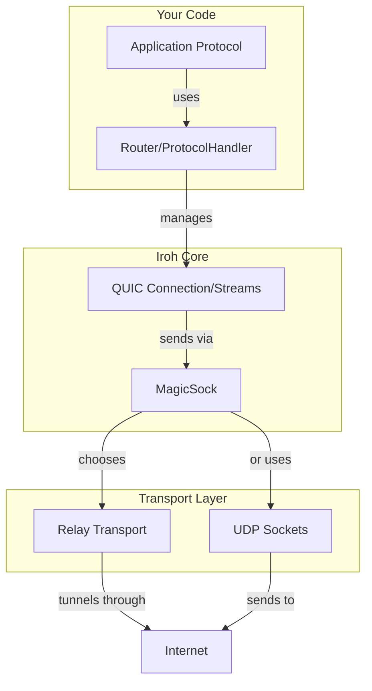
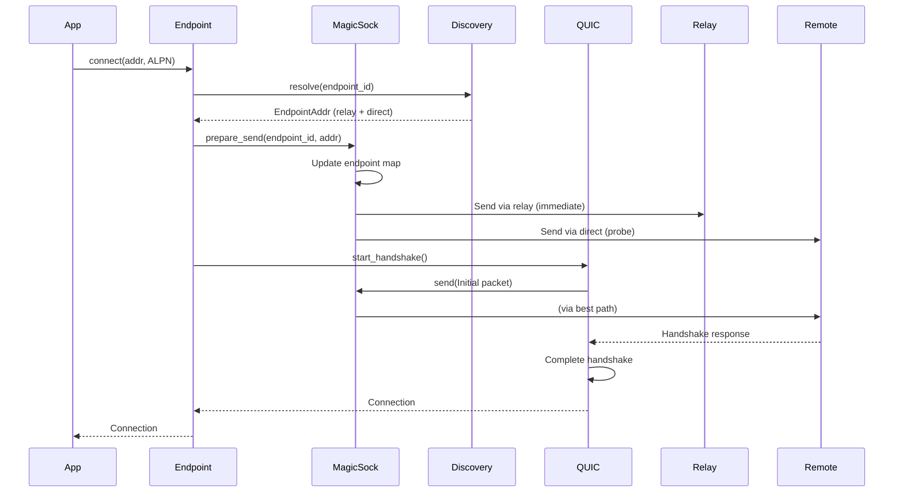

# Part 04: Iroh's Architecture Deep Dive

Time to see how the magic actually happens. You've been using iroh's high-level API. Now we'll understand the layers underneath: from UDP packets to encrypted QUIC connections to protocol routers.

## The Stack



Each layer has a specific job. Let's work bottom-up.

## Layer 1: UDP Sockets

Everything starts with UDP. QUIC runs over UDP, not TCP. Why UDP?

TCP's reliability and ordering are built into the kernel. If you want custom congestion control or multiple independent streams, you're stuck. UDP gives you a blank slate: send and receive datagrams with no guarantees.

Python UDP socket:

```python
import socket

sock = socket.socket(socket.AF_INET, socket.SOCK_DGRAM)
sock.bind(('0.0.0.0', 0))  # Bind to random port
sock.sendto(b"data", ("192.168.1.100", 8080))
data, addr = sock.recvfrom(4096)
```

Iroh binds both IPv4 and IPv6 sockets:

```rust
pub(crate) addr_v4: Option<SocketAddrV4>,
pub(crate) addr_v6: Option<SocketAddrV6>,
```

Why both? Because the internet is in a long, painful transition from IPv4 to IPv6. Some networks are IPv4-only, some are IPv6-only, most are dual-stack. To maximize connectivity, iroh listens on both.

If you don't specify addresses, iroh binds to `0.0.0.0:0` and `[::]:0`, letting the OS choose random ports. This is standard for P2P: you don't know your public port (it's assigned by NAT), so pick any local port.

## Layer 2: MagicSock (The Secret Sauce)

The name comes from Tailscale's implementation. MagicSock is a socket that "magically" maintains the best connection to a peer, switching between direct and relay paths transparently.

From `magicsock.rs`:

```rust
//! Implements a socket that can change its communication path while in use,
//! actively searching for the best way to communicate.
```

This is the layer that makes P2P work without manual NAT configuration.

### Transport Selection

MagicSock manages multiple transports:

1. **Direct UDP**: If both peers have routable addresses (public IPs or local network), send directly
2. **Relay**: If direct isn't possible, route through a relay server
3. **Hybrid**: Try both, use whichever works first

From the code:

```rust
pub(crate) struct Transports {
    relay: RelayTransport,
    ip: Option<IpTransport>,  // Direct UDP transport
}
```

When you call `endpoint.connect()`, MagicSock:

1. Sends initial packets via relay (guaranteed to work)
2. Simultaneously attempts direct connection (might work, might not)
3. If direct succeeds, switches to it
4. If direct fails or degrades, falls back to relay
5. Continuously probes for better paths

This is transparent to your application. You just send data; MagicSock handles routing.

### Connection Migration

QUIC supports connection migration: if your IP address changes (switch from WiFi to cellular), the connection can migrate without breaking.

MagicSock makes this automatic. If it detects a network change:

```rust
// Simplified from actual code
async fn handle_network_change(&self) {
    let new_addrs = self.local_addrs().await;
    self.update_endpoints(new_addrs).await;
    // QUIC connections automatically migrate to new addresses
}
```

Your application doesn't see the change. The `Connection` object remains valid. Streams continue. This is impossible with TCP (which is tied to IP 4-tuple: src IP, src port, dst IP, dst port).

### Endpoint Map

MagicSock maintains an `EndpointMap`: a mapping from `EndpointId` (public key) to `RemoteInfo` (connection state):

```rust
struct EndpointMap {
    by_endpoint_id: HashMap<EndpointId, RemoteInfo>,
    // ...
}

struct RemoteInfo {
    direct_addrs: BTreeSet<SocketAddr>,
    relay_url: Option<RelayUrl>,
    last_alive: Instant,
    // ...
}
```

When you want to send to an endpoint, MagicSock looks up the best address:

```rust
fn send_to(&self, endpoint_id: EndpointId, data: &[u8]) {
    let info = self.endpoint_map.get(endpoint_id);
    let addr = info.best_addr();  // Prefers direct, falls back to relay
    self.socket.send_to(data, addr);
}
```

This lookup happens for every packet. It's fast (hash table lookup + preference calculation), but not zero-cost. This is the price of automatic path selection.

## Layer 3: QUIC

QUIC handles:
- Encryption (TLS 1.3)
- Reliability (retransmits lost packets)
- Congestion control (avoids flooding the network)
- Streams (multiple independent byte streams per connection)

Iroh uses [quinn](https://github.com/quinn-rs/quinn), a pure Rust QUIC implementation.

### Handshake

When you call `endpoint.connect()`, QUIC performs a handshake:

1. Client sends Initial packet (containing TLS ClientHello)
2. Server responds with Initial (containing TLS ServerHello) and Handshake packets
3. Client sends Handshake packet
4. Connection established

This is 1-RTT (one round-trip time). The TLS handshake is integrated with QUIC, not layered on top like with TCP+TLS.

Iroh's twist: instead of traditional TLS certificates, it uses the endpoint's keypair. From `tls.rs`:

```rust
/// QUIC configuration for iroh endpoints.
///
/// Instead of standard X.509 certificates, we use the endpoint's ed25519 keypair
/// for authentication. Both sides verify the peer's public key matches the expected EndpointId.
```

This is simpler than managing certificates and enables key-based identity. You connect to `EndpointId` (public key), not a domain name.

### Stream Multiplexing

You've been using streams, but here's what happens under the hood:

```rust
let (mut send, mut recv) = conn.open_bi().await?;
```

QUIC assigns a stream ID (an integer). All data on this stream is tagged with that ID. When packets arrive, QUIC demultiplexes them:

```
Packet arrives: [stream_id=5, offset=0, data="hello"]
-> Route to stream 5's receive buffer at offset 0

Packet arrives: [stream_id=3, offset=100, data="world"]
-> Route to stream 3's receive buffer at offset 100
```

If stream 5's data is lost and needs retransmission, stream 3 is unaffected. This is the solution to TCP's head-of-line blocking.

Internally, quinn maintains a stream state machine per stream:

```rust
enum StreamState {
    Open,
    SendClosed,
    RecvClosed,
    Closed,
}
```

When you call `send.finish()`, the stream transitions to `SendClosed`. When the remote receives all data and reads EOF, it transitions to `RecvClosed`. When both sides close, the stream is freed.

### Congestion Control

QUIC uses congestion control to avoid flooding the network. By default, quinn uses [Cubic](https://en.wikipedia.org/wiki/CUBIC_TCP), the same algorithm as modern TCP.

The algorithm adjusts the congestion window (how much data can be in-flight) based on packet loss and RTT:

```
If packet loss:
    congestion_window *= 0.7  // Multiplicative decrease
If ACK received and no loss:
    congestion_window += f(time_since_loss)  // Cubic growth
```

This happens automatically. You don't configure it. But you can observe it: if your connection is slow, it might be congestion control reacting to packet loss.

## Layer 4: Router and Protocol Handlers

The Router maps ALPNs to protocol handlers:

```rust
let router = Router::builder(endpoint)
    .accept(b"echo/0", EchoHandler)
    .accept(b"filetransfer/1", FileHandler)
    .spawn();
```

When a connection arrives, the router checks the ALPN:

```rust
// Simplified from actual code
async fn handle_incoming(&self, mut incoming: Incoming) {
    let alpn = incoming.alpn();
    let handler = self.handlers.get(alpn)?;
    let conn = incoming.await?;
    tokio::spawn(async move {
        handler.accept(conn).await
    });
}
```

Each connection runs in its own task. If one handler panics or hangs, it doesn't affect others.

### Zero Handlers: Direct Endpoint Usage

You don't need a router. You can use the `Endpoint` directly:

```rust
let endpoint = Endpoint::builder()
    .alpns(vec![b"myprotocol".to_vec()])
    .bind()
    .await?;

while let Some(incoming) = endpoint.accept().await {
    let conn = incoming.await?;
    tokio::spawn(async move {
        handle_connection(conn).await;
    });
}
```

This is lower-level but gives you more control. Use this if you have a single protocol or need custom connection acceptance logic.

## The Discovery Layer (Optional but Useful)

You've been passing full `EndpointAddr` to connect:

```rust
let addr = EndpointAddr {
    endpoint_id: id,
    relay_url: Some(relay),
    direct_addrs: vec![],
};
endpoint.connect(addr, ALPN).await?;
```

But what if you only know the `EndpointId`? You need discovery.

Iroh supports multiple discovery mechanisms:

### DNS Discovery

Publish your addressing info to DNS, keyed by your endpoint ID:

```rust
use iroh::discovery::dns::DnsDiscovery;

let discovery = DnsDiscovery::builder("iroh.example".to_string());
let endpoint = Endpoint::builder()
    .discovery(discovery)
    .bind()
    .await?;
```

When you connect with just an `EndpointId`, the endpoint queries DNS:

```
Query: <endpoint_id>.iroh.example
Response: TXT records containing relay URL and direct addresses
```

This is how you can connect using only the endpoint ID:

```rust
let addr = EndpointAddr::from_parts(id, vec![]);  // No addresses
endpoint.connect(addr, ALPN).await?;  // Discovery fills them in
```

### Pkarr Discovery

An alternative to DNS using a distributed hash table (DHT). Endpoints publish their info to the DHT, others query it.

```rust
use iroh::discovery::pkarr::{PkarrPublisher, PkarrResolver};

let publisher = PkarrPublisher::builder(relay_url);
let endpoint = Endpoint::builder()
    .discovery(publisher)
    .bind()
    .await?;
```

Same interface, different backing store. This is more decentralized (no DNS authority) but requires DHT infrastructure.

### Local Network Discovery (mDNS)

For local network peers (same WiFi/LAN), use mDNS:

```rust
use iroh::discovery::mdns::MdnsDiscovery;

let discovery = MdnsDiscovery::builder().build(endpoint.id())?;
endpoint.discovery().add(discovery);
```

This broadcasts your presence on the local network. Other iroh endpoints see the announcement and can connect directly, without relay or DNS.

## Putting It All Together

Here's what happens when you call `endpoint.connect()`:



All of this happens in ~50-100ms (depending on network), and most of it is concurrent.

## Relay Servers

Relay servers are simple: they forward encrypted packets between endpoints. From `iroh-relay/`:

```rust
// Simplified relay logic
async fn handle_client(conn: TcpStream, clients: Arc<Mutex<HashMap<EndpointId, Sender>>>) {
    let endpoint_id = authenticate(&conn).await?;
    let (tx, mut rx) = mpsc::channel(100);
    clients.lock().insert(endpoint_id, tx);

    loop {
        tokio::select! {
            // Forward incoming packets to this client
            Some(packet) = rx.recv() => {
                conn.write_all(&packet).await?;
            }
            // Receive packets from this client and route them
            packet = read_packet(&conn) => {
                let dst = packet.destination();
                if let Some(dst_tx) = clients.lock().get(&dst) {
                    dst_tx.send(packet).await?;
                }
            }
        }
    }
}
```

Relays can't decrypt the packets (they're encrypted end-to-end). They just forward based on destination `EndpointId`.

You can run your own relay:

```bash
cargo run --bin iroh-relay -- --dev
```

Or use the default relays (run by number0, the company behind iroh).

## Performance Characteristics

Where does time go in a typical request?

1. **Network latency**: 10-100ms depending on distance
2. **Relay latency**: +20-50ms if using relay (extra hop)
3. **Handshake**: ~1 RTT (first connection only)
4. **Throughput**: Limited by network bandwidth and congestion control

Iroh's overhead is minimal:

- MagicSock path selection: ~1μs per packet (hash lookup)
- QUIC processing: ~10μs per packet (crypto, ACK generation)
- Stream demux: ~100ns (integer lookup)

Most of your latency is network, not iroh.

## Potential Issues and Limitations

Iroh is not perfect. Here are real issues you'll encounter:

### NAT Traversal Failure

Hole punching works ~80-90% of the time. For the remainder, you need a relay. If you disable relay, those connections will fail.

```rust
// This might fail for some peers
let endpoint = Endpoint::builder()
    .relay_mode(RelayMode::Disabled)
    .bind()
    .await?;
```

### Relay Bandwidth Costs

If most connections use relay, you're proxying all traffic through the relay servers. This costs bandwidth. You might want to:

1. Run your own relays (more control, but you pay for servers)
2. Use discovery to improve direct connection success rate
3. Accept that some connections will be slower

### Connection Establishment Latency

First connection to a peer: ~100ms (handshake + relay + path probing)
Subsequent connections: ~50ms (cached paths)

This is slower than local TCP (sub-ms) but acceptable for most applications. If you need sub-50ms connection setup, iroh might not be the right choice (or use connection pooling).

### Memory Usage

Each connection has overhead:
- QUIC state: ~10KB
- Stream buffers: ~32KB per stream (default)
- MagicSock endpoint info: ~1KB

With 10,000 connections, expect ~100MB+ memory usage. This is fine for servers, but might be high for embedded devices.

## Exercise: Instrument and Observe

Iroh has built-in metrics. Enable them:

```rust
use iroh::metrics::EndpointMetrics;

let metrics = EndpointMetrics::default();
let endpoint = Endpoint::builder()
    .metrics(metrics.clone())
    .bind()
    .await?;

// After some connections
println!("Relay bytes: {}", metrics.relay_bytes());
println!("Direct bytes: {}", metrics.direct_bytes());
println!("Connection type: {:?}", endpoint.conn_type(peer_id));
```

Build a tool that:
1. Connects to multiple peers
2. Transfers data
3. Reports the connection type (direct vs relay) and bytes transferred

See how often you get direct connections vs relay. Try different networks (home WiFi, mobile hotspot, VPN). Understand the real-world NAT traversal success rate.

## What You Learned

- Iroh's stack: UDP -> MagicSock -> QUIC -> Router -> Application
- MagicSock handles path selection and connection migration automatically
- QUIC provides encryption, streams, and congestion control
- Discovery mechanisms (DNS, Pkarr, mDNS) enable connecting with just an endpoint ID
- Relay servers provide fallback connectivity when direct fails
- Performance is dominated by network latency, not iroh overhead
- Real-world NAT traversal is imperfect; plan for relay usage

Next: Building a practical CLI file sharing tool. We'll combine everything learned so far to build something useful.
