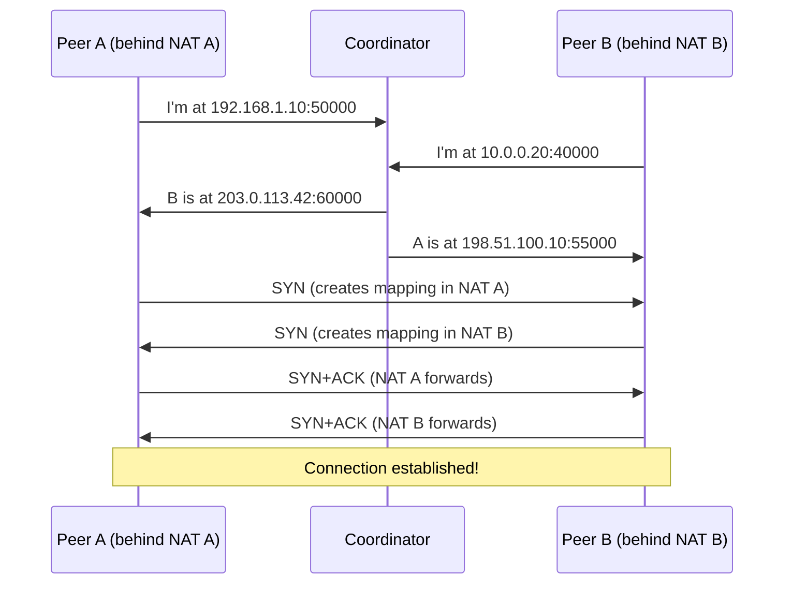
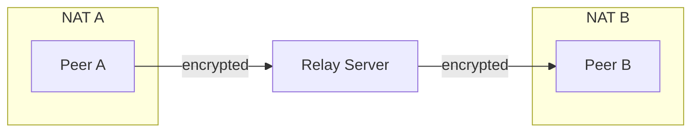

# Part 07: Deep P2P Concepts

You've been using iroh's P2P networking. Now let's understand the theory and practice behind it. NAT traversal, hole punching, relay servers, DHTs, and gossip protocols. The hard problems that iroh solves for you.

## The NAT Problem

In an ideal world, every device has a unique public IP address. Your laptop can directly connect to any other laptop. Reality is less cooperative.

### IPv4 Exhaustion

IPv4 has 2^32 (~4.3 billion) addresses. There are more devices than addresses. The solution: Network Address Translation (NAT).

```
Your network: 192.168.1.0/24 (private addresses)
├── Laptop: 192.168.1.10
├── Phone: 192.168.1.20
└── Tablet: 192.168.1.30
    ↓
Router (NAT): 203.0.113.42 (one public address)
```

When your laptop sends a packet to the internet, the router rewrites:
- Source IP: `192.168.1.10` → `203.0.113.42`
- Source port: `50123` → `60456` (mapped port)

When a reply comes back to `203.0.113.42:60456`, the router remembers the mapping and forwards to `192.168.1.10:50123`.

This works for outbound connections (you initiate). But for inbound connections (someone connects to you), the router has no mapping. Packets are dropped.

P2P requires both peers to potentially accept inbound connections. NAT breaks this.

## NAT Types and Behavior

Not all NATs are equal. They differ in mapping behavior:

### Full Cone NAT

Once the router creates a mapping (`internal:port` → `external:port`), anyone can send packets to `external:port` and they'll be forwarded to `internal:port`.

**Easy to traverse.** Rare in practice.

### Restricted Cone NAT

Mapping exists, but only packets from IPs you've sent to are forwarded. If you send to `1.2.3.4`, only `1.2.3.4` can send back (any port).

**Traversable with coordination.**

### Port Restricted Cone NAT

Like restricted cone, but the remote port must also match. If you send to `1.2.3.4:80`, only `1.2.3.4:80` can send back.

**Traversable with coordination.** Most common type.

### Symmetric NAT

Each destination gets a different mapping. Send to `1.2.3.4:80` from local port 50000, mapping is `external:60000`. Send to `5.6.7.8:80` from the same local port, mapping is `external:60001` (different).

**Hard to traverse.** Relay required.

## Hole Punching: Coordinated Connection

The trick: have both peers send to each other simultaneously. This creates mappings in both routers.



This is UDP hole punching. Works for most NAT types (except symmetric).

### STUN: Session Traversal Utilities for NAT

STUN is a protocol to discover your public IP and port. You send a STUN request to a STUN server, it responds with your public address as it sees it.

```rust
// Simplified STUN request
send_to_stun_server(request);
let response = receive_from_stun_server();
// response contains: your_public_ip, your_public_port
```

Iroh uses STUN internally (via the net report module) to learn its public addresses.

### ICE: Interactive Connectivity Establishment

ICE is the full algorithm for NAT traversal:

1. **Gather candidates**: All possible ways to reach you (local IPs, public IP via STUN, relay)
2. **Exchange candidates**: Send your list to peer, receive theirs
3. **Connectivity checks**: Try all candidate pairs, see which work
4. **Select best path**: Prefer direct, fall back to relay

Iroh implements ICE-like behavior in MagicSock. It's not exactly ICE (WebRTC's ICE is more complex), but the principles are the same.

## Relay Servers: The Fallback

When hole punching fails (symmetric NAT, firewall blocks, bad luck), use a relay.



Both peers connect to the relay (outbound, which NAT allows). The relay forwards encrypted packets between them. The relay can't decrypt (end-to-end encryption), it just routes based on destination endpoint ID.

### Relay Protocol

Iroh's relay protocol (simplified):

```
Client -> Relay: CONNECT <client_endpoint_id>
Relay -> Client: OK

Client -> Relay: SEND <destination_endpoint_id> <encrypted_payload>
Relay -> Destination: FROM <sender_endpoint_id> <encrypted_payload>
```

The relay maintains a map: `endpoint_id → TCP_connection`. When a packet arrives for an endpoint ID, it looks up the connection and forwards.

Python analogy:

```python
clients = {}  # endpoint_id -> connection

async def handle_client(reader, writer):
    endpoint_id = await read_endpoint_id(reader)
    clients[endpoint_id] = writer

    while True:
        dest, payload = await read_packet(reader)
        if dest in clients:
            await clients[dest].write(payload)
```

### TURN: Traversal Using Relays around NAT

TURN is the standard protocol for relay servers. Iroh uses a custom protocol (simpler, more efficient for its use case), but the concept is the same.

## Connection Migration

QUIC supports changing the underlying IP address without breaking the connection. Iroh uses this for seamless network transitions.

Scenario: You're on WiFi, streaming data. You walk outside, WiFi drops, mobile network takes over. With TCP, the connection breaks. With QUIC + iroh:

1. Mobile network activates, new IP address
2. MagicSock detects new local addresses
3. Sends QUIC packets from new address
4. Remote validates (using connection ID + crypto)
5. Connection migrates to new path
6. Data continues flowing

Zero interruption. Your application doesn't notice.

### Connection IDs

QUIC uses connection IDs instead of 4-tuple (src IP, src port, dst IP, dst port). Even if IPs change, the connection ID remains the same.

```rust
// Simplified QUIC packet
struct QuicPacket {
    connection_id: u64,
    packet_number: u64,
    payload: Vec<u8>,
}
```

The receiver looks up the connection by ID, not by address. This enables migration.

## Discovery Mechanisms

How do you find a peer if you only know their endpoint ID?

### DHT: Distributed Hash Table

A DHT is a distributed key-value store. Nodes store pieces of the data, lookups hop through nodes.

Kademlia (used by BitTorrent, IPFS) is a common DHT:

```
Nodes have 160-bit IDs (hash of public key)
Data has 160-bit keys (hash of content)

To find key K:
1. Start at your node
2. Ask neighbors "who's closer to K?"
3. Recurse to closer nodes
4. Eventually find node storing K
5. Retrieve value
```

Iroh doesn't use a DHT directly (yet), but the discovery layer is designed to support it. Pkarr (mainline DHT-based) is one option.

### DNS-Based Discovery

Store endpoint info in DNS TXT records:

```
<endpoint_id>._iroh.example.com IN TXT "relay=https://relay.example.com"
<endpoint_id>._iroh.example.com IN TXT "direct=198.51.100.10:41234"
```

To connect to an endpoint ID:
1. Query DNS: `<endpoint_id>._iroh.example.com`
2. Parse TXT records to get relay and direct addresses
3. Connect using those addresses

This centralizes discovery (DNS authority), but it's simple and works.

### Pkarr: Public Key Addressable Records

Mainline DHT (BitTorrent's DHT) + DNS records. You publish DNS records to the DHT, keyed by your public key.

```
Key: hash(public_key)
Value: DNS zone data (signed by public_key)
```

Anyone can look up your public key's DNS records from the DHT. Decentralized DNS.

Iroh supports this via `PkarrPublisher` and `PkarrResolver`. You publish your endpoint info to the DHT, peers query it.

## Gossip Protocols

You want to broadcast a message to all interested peers. Naive approach: send to each peer individually (O(N) messages). Better: gossip.

### Epidemic Gossip

Like spreading a rumor:

1. You learn a message
2. You tell a few random peers
3. They tell a few random peers
4. Exponentially spreads to everyone

```rust
async fn gossip_message(msg: Message, peers: Vec<PeerId>) {
    for peer in peers.choose_multiple(3) {  // Tell 3 random peers
        send_to_peer(peer, msg.clone()).await;
    }
}
```

After log(N) rounds, everyone has the message. Each peer only sends a few copies.

### Pub/Sub with Gossip

Combine gossip with topic subscriptions:

```rust
// Subscribe to a topic
endpoint.subscribe(b"topic-name");

// Publish to topic
endpoint.publish(b"topic-name", b"message");

// Internally: gossip the message to all subscribers
```

Iroh has `iroh-gossip` (separate crate) for this. It implements a mesh-based gossip protocol:

1. Peers form a mesh (partial connectivity)
2. Messages are gossiped through the mesh
3. Redundancy (multiple paths) ensures reliability
4. Pruning removes redundant connections

This scales better than full-mesh (everyone connected to everyone) but with similar properties.

## Practical: Implementing Basic Gossip

Let's build a simple gossip protocol on top of iroh:

```rust
use iroh::{Endpoint, EndpointId};
use std::collections::{HashSet, HashMap};
use tokio::sync::RwLock;
use std::sync::Arc;

struct GossipNode {
    endpoint: Endpoint,
    peers: Arc<RwLock<HashSet<EndpointId>>>,
    seen_messages: Arc<RwLock<HashSet<[u8; 32]>>>,  // Message hashes
    message_handler: Arc<dyn Fn(Vec<u8>) + Send + Sync>,
}

impl GossipNode {
    async fn new(handler: impl Fn(Vec<u8>) + Send + Sync + 'static) -> anyhow::Result<Self> {
        Ok(Self {
            endpoint: Endpoint::bind().await?,
            peers: Arc::new(RwLock::new(HashSet::new())),
            seen_messages: Arc::new(RwLock::new(HashSet::new())),
            message_handler: Arc::new(handler),
        })
    }

    async fn add_peer(&self, endpoint_id: EndpointId) {
        self.peers.write().await.insert(endpoint_id);
    }

    async fn gossip(&self, message: Vec<u8>) -> anyhow::Result<()> {
        let hash = blake3::hash(&message);
        let hash_bytes = *hash.as_bytes();

        // Don't gossip messages we've seen
        {
            let mut seen = self.seen_messages.write().await;
            if !seen.insert(hash_bytes) {
                return Ok(());  // Already seen
            }
        }

        // Call handler
        (self.message_handler)(message.clone());

        // Forward to random subset of peers
        let peers: Vec<_> = self.peers.read().await.iter().copied().collect();
        for peer in peers.iter().take(3) {  // Gossip to 3 peers
            let addr = iroh::EndpointAddr::from_parts(*peer, vec![]);
            if let Ok(conn) = self.endpoint.connect(addr, b"gossip/0").await {
                let mut stream = conn.open_uni().await?;
                stream.write_all(&message).await?;
                stream.finish()?;
            }
        }

        Ok(())
    }

    async fn listen(&self) {
        while let Some(incoming) = self.endpoint.accept().await {
            let node = self.clone();
            tokio::spawn(async move {
                if let Ok(conn) = incoming.accept()?.await {
                    let mut stream = conn.accept_uni().await?;
                    let message = stream.read_to_end(1024 * 1024).await?;
                    node.gossip(message).await?;
                }
                Ok::<(), anyhow::Error>(())
            });
        }
    }
}
```

This is a toy implementation, but shows the core idea:
- Track seen messages (avoid loops)
- Forward to subset of peers (limit amplification)
- Handle duplicates gracefully

Real gossip protocols (like `iroh-gossip`) add:
- Sequence numbers (ordering)
- Acknowledgments (reliability)
- Mesh management (peer selection, pruning)
- Flow control (rate limiting)

## Security Considerations

P2P systems have unique security challenges:

### Sybil Attacks

An attacker creates many fake identities to control the network.

**Mitigation**: Proof of work (expensive to create identities), proof of stake (require investment), or trusted bootstrap (only connect to known-good peers initially).

Iroh doesn't directly address this (it's application-specific), but endpoints are identified by public keys, which are somewhat expensive to generate (but not prohibitively so).

### Eclipse Attacks

An attacker isolates you by controlling all your connections. You only see the attacker's view of the network.

**Mitigation**: Connect to diverse peers (different IP ranges, different geolocations), use trusted bootstraps, implement reputation systems.

Iroh's relay system helps: even if direct connections are eclipsed, you can reach peers via relay.

### Traffic Analysis

An adversary monitors network traffic to infer who's talking to whom, even if content is encrypted.

**Mitigation**: Mix networks (Tor-style onion routing), dummy traffic (constant-rate fake messages), multi-hop routing.

Iroh doesn't implement these (too much overhead for most applications), but QUIC's encryption hides some patterns.

## Performance: Direct vs Relay

Let's measure the cost of relay:

```bash
# Direct connection (same network)
Latency: ~1ms
Throughput: ~1 Gbps (limited by CPU, not network)

# Direct connection (cross-country)
Latency: ~50ms
Throughput: ~100 Mbps (network-limited)

# Relay connection (same region)
Latency: ~20ms (extra hop)
Throughput: ~100 Mbps (relay-limited)

# Relay connection (cross-continent)
Latency: ~150ms (double the hops)
Throughput: ~50 Mbps (relay-limited)
```

Relay adds overhead. But it's better than nothing (which is what you get without relay when NAT traversal fails).

## Real-World NAT Traversal Success Rates

From various studies and our experience:

- **Full cone NAT**: ~100% success (rare)
- **Restricted cone**: ~90% success
- **Port-restricted cone**: ~80% success
- **Symmetric NAT**: ~0% direct, 100% with relay

Overall: expect ~70-80% direct connection success rate. The rest go through relay.

This is why relay infrastructure is critical for production P2P systems.

## Exercise: Measure Your Network

Build a tool to test NAT behavior:

```rust
async fn test_nat() {
    let endpoint = Endpoint::bind().await?;

    // Perform net report (STUN test)
    let report = endpoint.net_report().await?;

    println!("NAT type: {:?}", report.nat_type);
    println!("Public addresses: {:?}", report.public_addrs);
    println!("Preferred relay: {:?}", report.preferred_relay);

    // Try connecting to a known peer
    // Observe whether connection is direct or relay
}
```

Run this on different networks:
- Home WiFi
- Mobile hotspot
- Office network
- Coffee shop WiFi
- VPN

See how often you get direct connections. Understand real-world NAT behavior.

## What You Learned

- NAT breaks P2P by blocking inbound connections
- Hole punching coordinates simultaneous sends to create mappings
- Relay servers provide fallback when direct fails
- Connection migration enables seamless network changes
- Discovery (DHT, DNS, Pkarr) enables finding peers by ID
- Gossip protocols efficiently broadcast to many peers
- Real-world NAT traversal succeeds ~70-80% of the time
- Security challenges (Sybil, eclipse, traffic analysis) require careful design

Next: Cross-platform development. We'll build iroh applications for the web (via WebAssembly + Leptos) and desktop (via GPUI). Same backend, different frontends.
