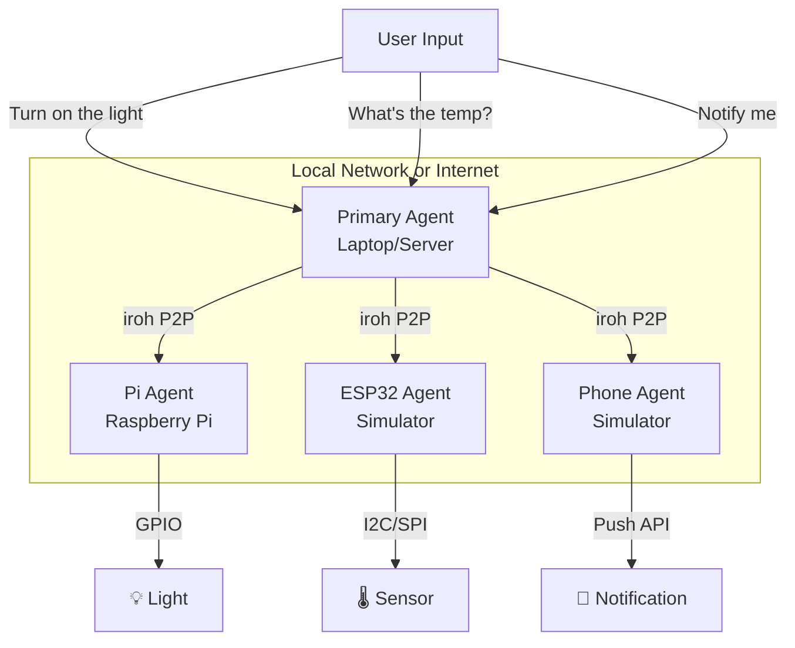

# Part 12: Distributed AI Agents: P2P Tool Execution Across Devices

Your agent from Part 11 runs on one machine. Now we'll distribute it. The agent on your laptop can execute tools on your Raspberry Pi (GPIO control, Docker management), your phone (notifications, location), or an ESP32 (sensor reading). All over P2P connections. No central server.

## The Architecture



The primary agent doesn't know how to control GPIO or read sensors. It delegates to device-specific agents that have those capabilities.

## Project Setup

```bash
cargo new --bin distributed-agent
cd distributed-agent
```

Dependencies:

```toml
[dependencies]
iroh = "0.30"
tokio = { version = "1", features = ["full"] }
serde = { version = "1", features = ["derive"] }
serde_json = "1"
anyhow = "1"
reqwest = { version = "0.12", features = ["json"] }
```

We're reusing the agent code from Part 11, plus adding iroh for P2P communication.

## The Protocol: Remote Tool Execution

Define a protocol for agents to communicate:

```rust
// src/protocol.rs
use serde::{Deserialize, Serialize};

const ALPN: &[u8] = b"agent-rpc/0";

#[derive(Debug, Serialize, Deserialize)]
pub enum AgentRequest {
    /// List available tools on this agent
    ListTools,
    /// Execute a tool
    ExecuteTool { name: String, input: serde_json::Value },
    /// Ping to check if agent is alive
    Ping,
}

#[derive(Debug, Serialize, Deserialize)]
pub enum AgentResponse {
    /// List of tools this agent can execute
    Tools(Vec<ToolDescriptor>),
    /// Result of tool execution
    ToolResult { success: bool, output: String },
    /// Pong response
    Pong,
    /// Error occurred
    Error(String),
}

#[derive(Debug, Clone, Serialize, Deserialize)]
pub struct ToolDescriptor {
    pub name: String,
    pub description: String,
    pub device_type: String,  // "pi", "phone", "esp32", etc.
}

pub fn alpn() -> &'static [u8] {
    ALPN
}
```

This is a simple RPC protocol. An agent can:
1. Ask another agent what tools it has
2. Request tool execution
3. Get results back

## Device Agent: Raspberry Pi

```rust
// src/agents/pi_agent.rs
use crate::protocol::*;
use anyhow::Result;
use iroh::Endpoint;
use serde_json::json;

pub struct PiAgent {
    tools: Vec<ToolDescriptor>,
}

impl PiAgent {
    pub fn new() -> Self {
        Self {
            tools: vec![
                ToolDescriptor {
                    name: "gpio_set".to_string(),
                    description: "Set GPIO pin high or low".to_string(),
                    device_type: "pi".to_string(),
                },
                ToolDescriptor {
                    name: "docker_ps".to_string(),
                    description: "List running Docker containers".to_string(),
                    device_type: "pi".to_string(),
                },
                ToolDescriptor {
                    name: "cpu_temp".to_string(),
                    description: "Get CPU temperature".to_string(),
                    device_type: "pi".to_string(),
                },
            ],
        }
    }

    pub fn get_tools(&self) -> Vec<ToolDescriptor> {
        self.tools.clone()
    }

    pub async fn execute_tool(&self, name: &str, input: serde_json::Value) -> Result<String> {
        match name {
            "gpio_set" => self.gpio_set(input).await,
            "docker_ps" => self.docker_ps().await,
            "cpu_temp" => self.cpu_temp().await,
            _ => anyhow::bail!("Unknown tool: {}", name),
        }
    }

    async fn gpio_set(&self, input: serde_json::Value) -> Result<String> {
        let pin = input["pin"].as_u64().ok_or_else(|| anyhow::anyhow!("Missing pin"))?;
        let state = input["state"].as_str().ok_or_else(|| anyhow::anyhow!("Missing state"))?;

        // In production, use rppal or sysfs_gpio crate
        // For demonstration, we'll simulate
        #[cfg(target_arch = "aarch64")]
        {
            // Actual GPIO control on ARM (Pi)
            use std::fs;
            fs::write(format!("/sys/class/gpio/gpio{}/value", pin), if state == "high" { "1" } else { "0" })?;
            Ok(format!("GPIO pin {} set to {}", pin, state))
        }
        #[cfg(not(target_arch = "aarch64"))]
        {
            // Simulation on x86
            Ok(format!("[SIMULATED] GPIO pin {} set to {}", pin, state))
        }
    }

    async fn docker_ps(&self) -> Result<String> {
        let output = tokio::process::Command::new("docker")
            .args(["ps", "--format", "{{.Names}}: {{.Status}}"])
            .output()
            .await?;

        if output.status.success() {
            Ok(String::from_utf8_lossy(&output.stdout).to_string())
        } else {
            Ok("No Docker containers running".to_string())
        }
    }

    async fn cpu_temp(&self) -> Result<String> {
        #[cfg(target_os = "linux")]
        {
            // Try to read from thermal zone (works on Pi and many Linux systems)
            if let Ok(temp) = tokio::fs::read_to_string("/sys/class/thermal/thermal_zone0/temp").await {
                let temp_celsius = temp.trim().parse::<f64>()? / 1000.0;
                return Ok(format!("{:.1}°C", temp_celsius));
            }
        }
        Ok("Temperature sensor not available".to_string())
    }
}

pub async fn run_pi_agent(endpoint: Endpoint) -> Result<()> {
    let agent = PiAgent::new();

    println!("Pi Agent running");
    println!("Endpoint ID: {}", endpoint.id());
    println!("Available tools: {:?}", agent.get_tools().iter().map(|t| &t.name).collect::<Vec<_>>());

    while let Some(incoming) = endpoint.accept().await {
        let agent = agent.clone();
        tokio::spawn(async move {
            if let Err(e) = handle_connection(incoming, agent).await {
                eprintln!("Connection error: {}", e);
            }
        });
    }

    Ok(())
}

async fn handle_connection(
    incoming: iroh::endpoint::Incoming,
    agent: PiAgent,
) -> Result<()> {
    let conn = incoming.accept()?.await?;
    let (mut send, mut recv) = conn.accept_bi().await?;

    let mut buf = vec![0u8; 65536];
    let n = recv.read(&mut buf).await?;
    let request: AgentRequest = serde_json::from_slice(&buf[..n])?;

    let response = match request {
        AgentRequest::ListTools => AgentResponse::Tools(agent.get_tools()),
        AgentRequest::ExecuteTool { name, input } => {
            match agent.execute_tool(&name, input).await {
                Ok(output) => AgentResponse::ToolResult {
                    success: true,
                    output,
                },
                Err(e) => AgentResponse::ToolResult {
                    success: false,
                    output: e.to_string(),
                },
            }
        }
        AgentRequest::Ping => AgentResponse::Pong,
    };

    let response_bytes = serde_json::to_vec(&response)?;
    send.write_all(&response_bytes).await?;
    send.finish()?;

    Ok(())
}
```

This agent runs on a Raspberry Pi. It exposes GPIO control, Docker management, and temperature monitoring.

**Real GPIO on Pi**: Use the [`rppal`](https://github.com/golemparts/rppal) crate for actual GPIO control:

```rust
use rppal::gpio::Gpio;

async fn gpio_set(&self, input: serde_json::Value) -> Result<String> {
    let pin = input["pin"].as_u64()? as u8;
    let state = input["state"].as_str()?;

    let gpio = Gpio::new()?;
    let mut pin = gpio.get(pin)?.into_output();

    if state == "high" {
        pin.set_high();
    } else {
        pin.set_low();
    }

    Ok(format!("GPIO pin {} set to {}", pin, state))
}
```

## Device Agent: Phone (Simulator)

```rust
// src/agents/phone_agent.rs
use crate::protocol::*;
use anyhow::Result;

pub struct PhoneAgent {
    tools: Vec<ToolDescriptor>,
}

impl PhoneAgent {
    pub fn new() -> Self {
        Self {
            tools: vec![
                ToolDescriptor {
                    name: "notify".to_string(),
                    description: "Send a push notification".to_string(),
                    device_type: "phone".to_string(),
                },
                ToolDescriptor {
                    name: "get_location".to_string(),
                    description: "Get current GPS location".to_string(),
                    device_type: "phone".to_string(),
                },
            ],
        }
    }

    pub fn get_tools(&self) -> Vec<ToolDescriptor> {
        self.tools.clone()
    }

    pub async fn execute_tool(&self, name: &str, input: serde_json::Value) -> Result<String> {
        match name {
            "notify" => self.notify(input).await,
            "get_location" => self.get_location().await,
            _ => anyhow::bail!("Unknown tool: {}", name),
        }
    }

    async fn notify(&self, input: serde_json::Value) -> Result<String> {
        let message = input["message"].as_str().ok_or_else(|| anyhow::anyhow!("Missing message"))?;

        // In production, use a push notification service (FCM, APNs)
        // For simulation, just print
        println!("📱 NOTIFICATION: {}", message);
        Ok(format!("Notification sent: {}", message))
    }

    async fn get_location(&self) -> Result<String> {
        // In production, use platform-specific location APIs via FFI
        // For simulation, return mock data
        Ok("Location: 37.7749°N, 122.4194°W (San Francisco)".to_string())
    }
}

// Similar run_phone_agent function as Pi agent
```

On a real phone, you'd use FFI to call native iOS/Android APIs for notifications and location. See Part 09 for details.

## Device Agent: ESP32 (Simulator)

```rust
// src/agents/esp32_agent.rs
use crate::protocol::*;
use anyhow::Result;

pub struct Esp32Agent {
    tools: Vec<ToolDescriptor>,
}

impl Esp32Agent {
    pub fn new() -> Self {
        Self {
            tools: vec![
                ToolDescriptor {
                    name: "read_sensor".to_string(),
                    description: "Read temperature and humidity from DHT22 sensor".to_string(),
                    device_type: "esp32".to_string(),
                },
                ToolDescriptor {
                    name: "toggle_led".to_string(),
                    description: "Toggle onboard LED".to_string(),
                    device_type: "esp32".to_string(),
                },
            ],
        }
    }

    pub fn get_tools(&self) -> Vec<ToolDescriptor> {
        self.tools.clone()
    }

    pub async fn execute_tool(&self, name: &str, input: serde_json::Value) -> Result<String> {
        match name {
            "read_sensor" => self.read_sensor().await,
            "toggle_led" => self.toggle_led().await,
            _ => anyhow::bail!("Unknown tool: {}", name),
        }
    }

    async fn read_sensor(&self) -> Result<String> {
        // Simulated sensor reading
        // On real ESP32, use embassy or esp-idf-hal to read I2C/SPI sensors
        use rand::Rng;
        let mut rng = rand::thread_rng();
        let temp = 20.0 + rng.gen::<f64>() * 10.0;
        let humidity = 40.0 + rng.gen::<f64>() * 20.0;

        Ok(format!("Temperature: {:.1}°C, Humidity: {:.1}%", temp, humidity))
    }

    async fn toggle_led(&self) -> Result<String> {
        // Simulated LED toggle
        // On real ESP32, use GPIO pin
        Ok("LED toggled".to_string())
    }
}

// Similar run_esp32_agent function
```

## Primary Agent: The Orchestrator

The primary agent (on your laptop or server) discovers device agents and delegates tasks:

```rust
// src/agents/primary_agent.rs
use crate::protocol::*;
use anyhow::Result;
use iroh::{Endpoint, EndpointAddr, EndpointId};
use std::collections::HashMap;

pub struct PrimaryAgent {
    endpoint: Endpoint,
    device_agents: HashMap<EndpointId, Vec<ToolDescriptor>>,
}

impl PrimaryAgent {
    pub fn new(endpoint: Endpoint) -> Self {
        Self {
            endpoint,
            device_agents: HashMap::new(),
        }
    }

    /// Register a device agent by endpoint ID
    pub async fn register_device(&mut self, endpoint_id: EndpointId, addr: EndpointAddr) -> Result<()> {
        // Connect to the device agent
        let conn = self.endpoint.connect(addr, alpn()).await?;

        // Request tool list
        let (mut send, mut recv) = conn.open_bi().await?;
        let request = AgentRequest::ListTools;
        send.write_all(&serde_json::to_vec(&request)?).await?;
        send.finish()?;

        let response_bytes = recv.read_to_end(65536).await?;
        let response: AgentResponse = serde_json::from_slice(&response_bytes)?;

        if let AgentResponse::Tools(tools) = response {
            println!("Registered device {} with {} tools", endpoint_id.fmt_short(), tools.len());
            for tool in &tools {
                println!("  - {} ({})", tool.name, tool.description);
            }
            self.device_agents.insert(endpoint_id, tools);
        }

        Ok(())
    }

    /// Execute a tool on a remote device
    pub async fn execute_remote_tool(
        &self,
        endpoint_id: EndpointId,
        tool_name: &str,
        input: serde_json::Value,
    ) -> Result<String> {
        // Connect to device
        let addr = EndpointAddr::from_parts(endpoint_id, vec![]);
        let conn = self.endpoint.connect(addr, alpn()).await?;

        // Send tool execution request
        let (mut send, mut recv) = conn.open_bi().await?;
        let request = AgentRequest::ExecuteTool {
            name: tool_name.to_string(),
            input,
        };
        send.write_all(&serde_json::to_vec(&request)?).await?;
        send.finish()?;

        // Get result
        let response_bytes = recv.read_to_end(65536).await?;
        let response: AgentResponse = serde_json::from_slice(&response_bytes)?;

        match response {
            AgentResponse::ToolResult { success, output } => {
                if success {
                    Ok(output)
                } else {
                    anyhow::bail!("Tool execution failed: {}", output)
                }
            }
            AgentResponse::Error(e) => anyhow::bail!("Remote error: {}", e),
            _ => anyhow::bail!("Unexpected response"),
        }
    }

    /// Get all available tools across all devices
    pub fn get_all_tools(&self) -> Vec<ToolDescriptor> {
        self.device_agents
            .values()
            .flat_map(|tools| tools.iter().cloned())
            .collect()
    }

    /// Find which device has a specific tool
    pub fn find_device_for_tool(&self, tool_name: &str) -> Option<EndpointId> {
        for (device_id, tools) in &self.device_agents {
            if tools.iter().any(|t| t.name == tool_name) {
                return Some(*device_id);
            }
        }
        None
    }
}
```

## Integrating with the AI Agent

Now modify the AI agent from Part 11 to use remote tools:

```rust
// src/main.rs
mod protocol;
mod agents;

use agents::primary_agent::PrimaryAgent;
use anyhow::Result;
use iroh::Endpoint;

#[tokio::main]
async fn main() -> Result<()> {
    let api_key = std::env::var("ANTHROPIC_API_KEY")
        .expect("ANTHROPIC_API_KEY not set");

    // Create iroh endpoint
    let endpoint = Endpoint::bind().await?;
    println!("Primary agent endpoint ID: {}", endpoint.id());

    // Create primary agent
    let mut primary = PrimaryAgent::new(endpoint.clone());

    // Register device agents (you'd get these from config or discovery)
    // For testing, manually provide device addresses
    if let Ok(pi_addr) = std::env::var("PI_AGENT_ADDR") {
        let addr: EndpointAddr = pi_addr.parse()?;
        primary.register_device(addr.id, addr).await?;
    }

    // Create tool definitions for Claude, including remote tools
    let tools = create_tool_definitions(&primary);

    // Run the agent loop (similar to Part 11, but with remote tool execution)
    run_agent_loop(api_key, primary, tools).await?;

    Ok(())
}

fn create_tool_definitions(primary: &PrimaryAgent) -> Vec<api::Tool> {
    let mut tools = vec![
        // Local tools
        api::Tool {
            name: "web_search".to_string(),
            description: "Search the web".to_string(),
            input_schema: serde_json::json!({
                "type": "object",
                "properties": {
                    "query": {"type": "string"}
                },
                "required": ["query"]
            }),
        },
    ];

    // Add remote tools from device agents
    for tool_desc in primary.get_all_tools() {
        tools.push(api::Tool {
            name: format!("{}@{}", tool_desc.name, tool_desc.device_type),
            description: format!("{} (on {})", tool_desc.description, tool_desc.device_type),
            input_schema: serde_json::json!({
                "type": "object",
                "properties": {},
                "required": []
            }),
        });
    }

    tools
}

async fn execute_tool(
    primary: &PrimaryAgent,
    tool_name: &str,
    input: serde_json::Value,
) -> Result<String> {
    // Local tools
    if tool_name == "web_search" {
        return web_search(input).await;
    }

    // Remote tools: format is "tool_name@device_type"
    if let Some(at_pos) = tool_name.find('@') {
        let actual_tool = &tool_name[..at_pos];

        // Find which device has this tool
        if let Some(device_id) = primary.find_device_for_tool(actual_tool) {
            return primary.execute_remote_tool(device_id, actual_tool, input).await;
        }
    }

    anyhow::bail!("Unknown tool: {}", tool_name)
}
```

## Running the Distributed System

**Terminal 1 (Pi agent)**:

```bash
# On Raspberry Pi
cargo build --release --target armv7-unknown-linux-gnueabihf
./target/release/distributed-agent --mode pi

# Output:
# Pi Agent running
# Endpoint ID: abc123...
# Available tools: ["gpio_set", "docker_ps", "cpu_temp"]
```

**Terminal 2 (Primary agent)**:

```bash
# On laptop
export PI_AGENT_ADDR=iroh://abc123...
cargo run --release -- --mode primary

# Output:
# Primary agent endpoint ID: def456...
# Registered device abc123... with 3 tools
#   - gpio_set (Set GPIO pin high or low)
#   - docker_ps (List running Docker containers)
#   - cpu_temp (Get CPU temperature)
# AI Agent ready
```

**Conversation**:

```
> Turn on the light connected to GPIO pin 17

[Calling tool: gpio_set@pi]
[Tool result: GPIO pin 17 set to high]

I've turned on the light connected to GPIO pin 17 on your Raspberry Pi.

> What's the CPU temperature on the Pi?

[Calling tool: cpu_temp@pi]
[Tool result: 52.3°C]

The CPU temperature on your Raspberry Pi is currently 52.3°C.

> Are there any Docker containers running?

[Calling tool: docker_ps@pi]
[Tool result: nginx: Up 2 hours
postgres: Up 5 days]

Yes, you have two Docker containers running:
- nginx (running for 2 hours)
- postgres (running for 5 days)
```

Claude automatically:
1. Understands the user's intent
2. Selects the appropriate tool
3. Provides the device type in the tool name
4. The primary agent routes to the correct device
5. Executes the tool remotely
6. Returns results to Claude
7. Claude formulates a natural language response

## Security Model

Right now, any device agent will execute any request. This is fine for personal use but dangerous otherwise.

### Tool-Based Access Control

```rust
// src/security.rs
use crate::protocol::*;
use iroh::EndpointId;
use std::collections::{HashMap, HashSet};

pub struct AccessControl {
    // Map: device_id -> allowed tools
    permissions: HashMap<EndpointId, HashSet<String>>,
}

impl AccessControl {
    pub fn new() -> Self {
        Self {
            permissions: HashMap::new(),
        }
    }

    pub fn grant(&mut self, device: EndpointId, tool: String) {
        self.permissions.entry(device).or_insert_with(HashSet::new).insert(tool);
    }

    pub fn check(&self, device: EndpointId, tool: &str) -> bool {
        self.permissions
            .get(&device)
            .map(|tools| tools.contains(tool) || tools.contains("*"))
            .unwrap_or(false)
    }
}
```

In the device agent:

```rust
async fn handle_connection(
    incoming: iroh::endpoint::Incoming,
    agent: PiAgent,
    acl: AccessControl,
) -> Result<()> {
    let conn = incoming.accept()?.await?;
    let remote_id = conn.remote_id();

    // ... receive request ...

    if let AgentRequest::ExecuteTool { name, input } = request {
        // Check permission
        if !acl.check(remote_id, &name) {
            let response = AgentResponse::Error(format!("Permission denied for tool: {}", name));
            // Send error response
            return Ok(());
        }

        // Execute tool
        // ...
    }
}
```

Now you can configure which agents can execute which tools on which devices.

### Encryption and Authentication

Iroh already provides:
- **Encryption**: All traffic is encrypted (QUIC uses TLS 1.3)
- **Authentication**: Endpoints are identified by public keys

You know exactly who you're talking to (their endpoint ID). You can whitelist endpoint IDs at the device agent level.

## Advanced: Tool Discovery

Instead of manually registering devices, use iroh's discovery mechanisms:

```rust
// Device agents publish their capabilities
use iroh::discovery::pkarr::PkarrPublisher;

let publisher = PkarrPublisher::builder(relay_url)
    .publish_metadata(serde_json::json!({
        "type": "agent",
        "device_type": "pi",
        "tools": ["gpio_set", "docker_ps", "cpu_temp"],
    }));

let endpoint = Endpoint::builder()
    .discovery(publisher)
    .bind()
    .await?;

// Primary agent discovers devices
let resolver = PkarrResolver::new(relay_url);
let devices = resolver.resolve_by_metadata(|meta| {
    meta["type"] == "agent"
}).await?;

for device in devices {
    primary.register_device(device.endpoint_id, device.addr).await?;
}
```

Now devices automatically advertise their presence and capabilities. The primary agent discovers them without manual configuration.

## Real-World Scenario: Home Automation

```
> If the temperature in my office goes above 25°C, turn on the fan

[Calling tool: read_sensor@esp32]
[Tool result: Temperature: 26.3°C, Humidity: 45%]

The temperature is 26.3°C, which is above 25°C.

[Calling tool: gpio_set@pi]
[Tool result: GPIO pin 18 set to high]

I've turned on the fan connected to GPIO pin 18.

> Monitor the temperature every 5 minutes and alert me if it stays above 25°C

I'll set up monitoring for you. However, I can't run continuous background tasks yet.
You could implement this by running a scheduler on the primary agent.
```

Implement continuous monitoring:

```rust
// In primary agent
tokio::spawn(async move {
    let mut interval = tokio::time::interval(Duration::from_secs(300));
    loop {
        interval.tick().await;

        let temp_result = primary.execute_remote_tool(
            esp32_id,
            "read_sensor",
            json!({}),
        ).await;

        if let Ok(result) = temp_result {
            if result.contains("26") || result.contains("27") {  // Crude parsing
                // Alert user
                primary.execute_remote_tool(
                    phone_id,
                    "notify",
                    json!({"message": "Office temperature still high!"}),
                ).await.ok();
            }
        }
    }
});
```

## Orchestration Patterns

### Sequential Execution

```rust
// "First check if the server is responding, then restart it if not"

// 1. Check server
let ping_result = primary.execute_remote_tool(
    pi_id,
    "http_get",
    json!({"url": "http://localhost:8080/health"}),
).await;

// 2. Restart if needed
if ping_result.is_err() {
    primary.execute_remote_tool(
        pi_id,
        "docker_restart",
        json!({"container": "nginx"}),
    ).await?;
}
```

### Parallel Execution

```rust
// "Check the status of all my Pis"

let pi_ids = vec![pi1_id, pi2_id, pi3_id];
let futures = pi_ids.iter().map(|id| {
    primary.execute_remote_tool(*id, "cpu_temp", json!({}))
});

let results = futures::future::join_all(futures).await;

for (i, result) in results.iter().enumerate() {
    println!("Pi {}: {:?}", i + 1, result);
}
```

### Conditional Logic

```rust
// "If my laptop battery is low, offload computation to the Pi"

let battery = get_local_battery_level().await?;

if battery < 20 {
    // Offload to Pi
    primary.execute_remote_tool(
        pi_id,
        "run_python",
        json!({"code": expensive_computation}),
    ).await?
} else {
    // Run locally
    run_local_computation().await?
}
```

Claude can decide these patterns based on the user's natural language request.

## Exercise: Multi-Agent Collaboration

Build a scenario where multiple agents collaborate:

1. **User**: "Analyze the sensor data from my ESP32 and if the air quality is bad, turn on the air purifier via the Pi and notify me on my phone"

2. **Primary agent**:
   - Calls `read_air_quality@esp32`
   - Analyzes the result
   - If bad, calls `gpio_set@pi` (turn on purifier)
   - Calls `notify@phone`

3. **Agents respond**: ESP32 reads sensor, Pi controls GPIO, phone sends notification

Implement the full flow. Bonus: Add logging to track the sequence of operations.

## Python Comparison

In Python, you'd use:
- `asyncio` for concurrency
- `aiohttp` or `httpx` for HTTP
- A message queue (RabbitMQ, Redis) for device communication

But P2P is harder. You'd need:
- Manual NAT traversal (complex)
- Central server to coordinate (not truly P2P)
- VPN or Tailscale (adds dependency)

Iroh gives you P2P out of the box. The Python equivalent would be significantly more complex.

## What You Learned

- Building a P2P RPC protocol with iroh
- Device-specific agents (Pi, phone, ESP32)
- Remote tool execution across devices
- Primary agent orchestration patterns
- Security: access control and authentication
- Tool discovery and registration
- Real-world scenarios: home automation, distributed computation
- Rust + iroh makes distributed systems practical

You now have a distributed AI agent system. Your laptop's agent can control your home, manage your servers, and coordinate across devices. All over encrypted P2P connections. No central server.

Welcome to the future of AI agents.
